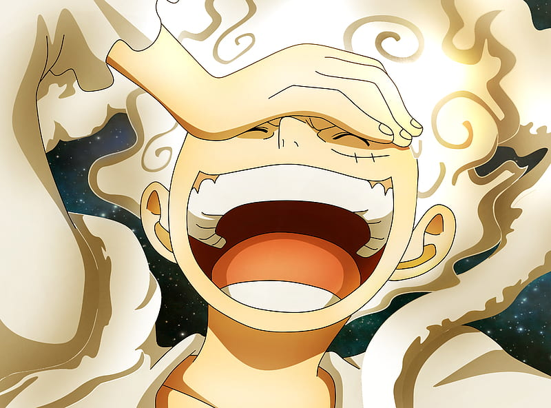
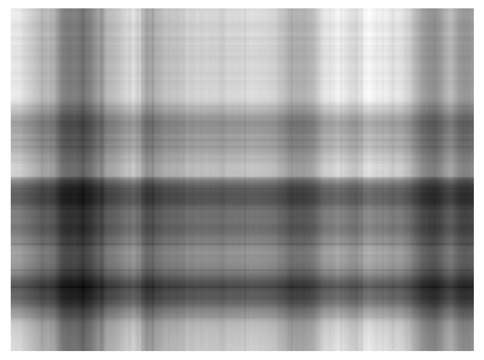
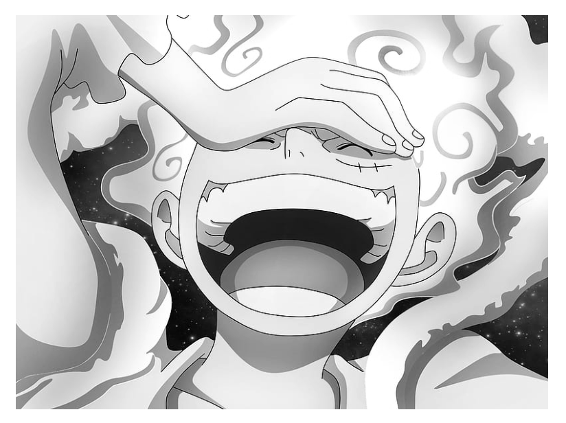
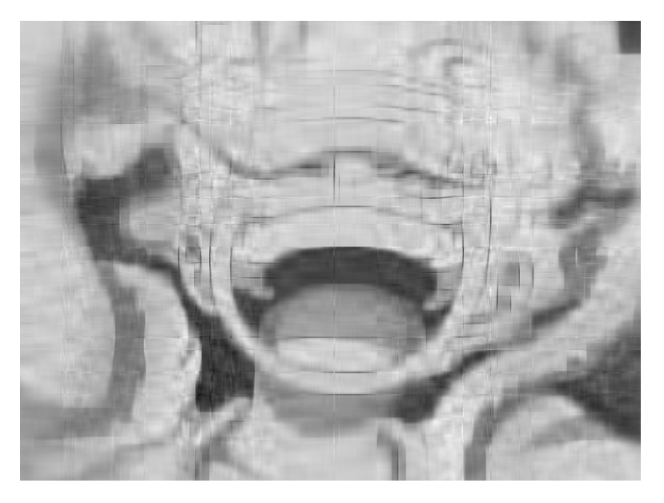
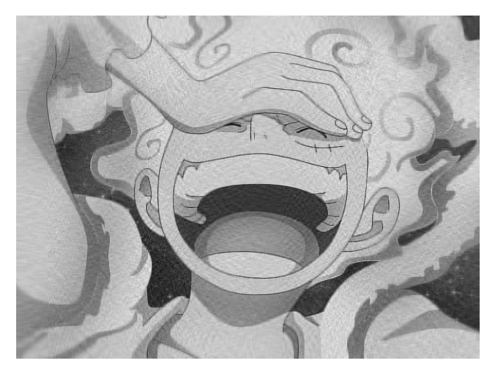
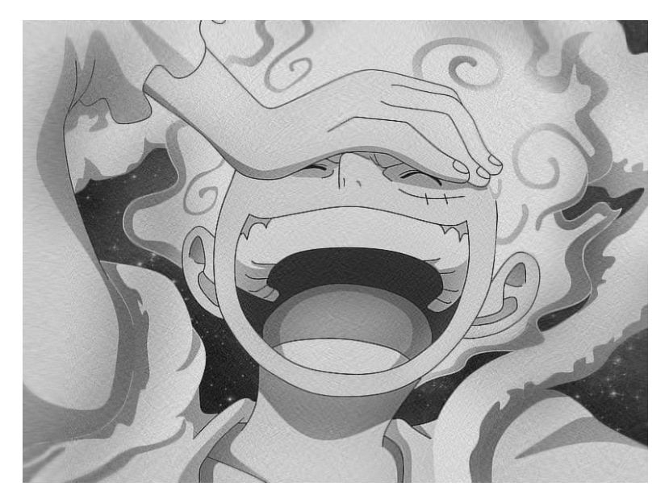
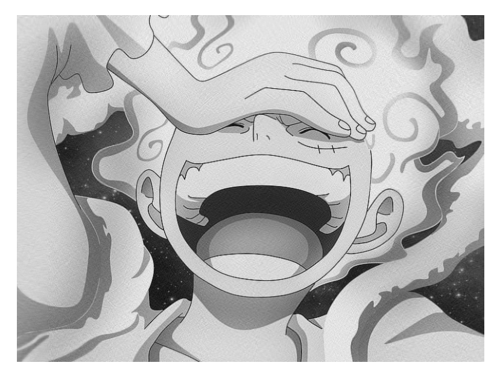
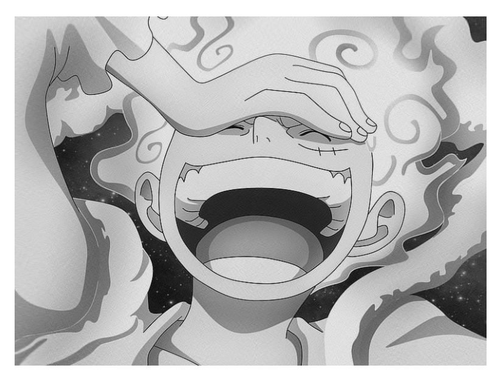
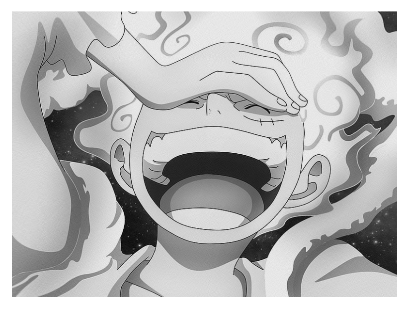
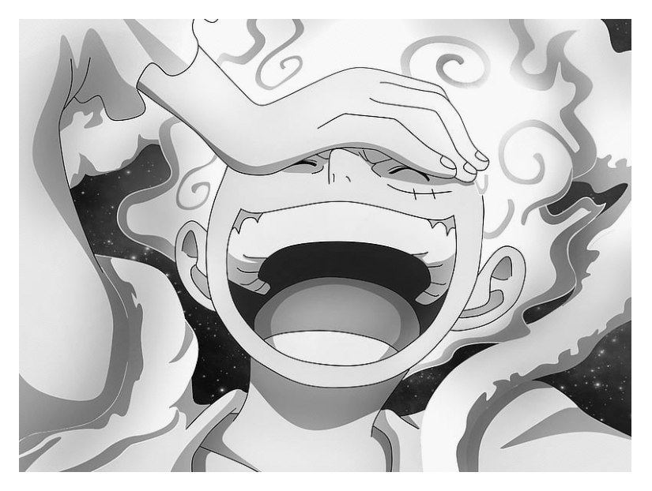

# 
🔥  PracticeLinear_Lab6  🔥

## 🐒 Будущий король пиратов Luffy

◽ Основной принцип сжатия с использованием SVD (Singular Value Decomposition) заключается в том, что Мы стараемся с помощью k-компоненты убрать малозначимые (в которых «мало» информации векторы), тем самым уменьшив общий объём изображение, сохраняя при этом основные характеристики и важные данные. 

◽ SVD разлагает матрицу данных на три составляющие - сингулярные значения, левые и правые сингулярные векторы, что позволяет нам редуцировать информацию до её ключевых компонентов, сэкономив при этом пространство или объём хранения данных.

❗Хотя бывают случаи, когда при SVD разложении, общая емкость даже больше исходного размера образа.

## 🌟 Pезультаты сжатия изображений
|k|Новое изображение|Исходное изображение|Размер по сравнению с исходным изображением(%)|
|:---:|:-----------------------------------------:|:-----------------------------------------:|:----:|
|1|||59.3|
|20|||86.1|
|75|||125.3|
|100|||132.85|
|150|||139.78|
|200|||143.53|
|250|||141.36|
|300|||139.35|
|450|||123.98|

1. Влияние параметра k на качество изображения:
   - Параметр k в методе разложения по сингулярным значениям (SVD) влияет на качество изображения в контексте сжатия изображения. Этот параметр определяет, сколько сингулярных значений (и соответствующих им сингулярных векторов) мы решаем сохранить при восстановлении изображения после его сжатия.
   - Чем больше значение k, тем больше информации мы можем сохранить и, следовательно, тем выше качество восстановленного изображения. Однако более высокие значения k также требуют больше памяти и вычислительных ресурсов.
   - И наоборот, меньшее значение k приводит к большему сжатию изображения, что уменьшает размер файла и вычислительные требования, но также может привести к потере детализации и качества реконструированного изображения, поскольку теряется меньше информации.

2. При каких значениях k картинка имеет приемлемое качество?
   - Для значений k, соответствующих относительно высокому проценту сохраняемой информации (например, около 80% или выше), изображение, как правило, будет достаточного качества, чтобы быть заметным без потери примечательных деталей.
     
3. При каких значениях качество уже не очень, но картинка всё ещё различима?
   - Напротив, для значений k, при которых объем сохраняемой информации составляет менее 50%, качество изображения не будет таким четким, как исходное изображение.
   - Но все же есть случаи со значением k, когда процент сохраняемой информации превышает 50%, но качество изображения значительно снижается по сравнению с исходным изображением. (например: k = 75, k = 100)

4. Для каких k картинка становится совершенно непонятной?
   - Когда значение k (количество компонентов, используемых в SVD) становится слишком малым, изображение становится нечетким или даже становится совершенно неузнаваемым. Это происходит потому, что уменьшение количества важных компонентов в SVD приводит к потере важной информации.
   - Как только k станет слишком маленьким:
     - Изображения могут стать размытыми.
     - Детали и структура изображения будут потеряны.
     - Иногда изображение может представлять собой серию точек или пятен без четкой формы и структуры.
    
5. Оцените численно степень сжатия изображения при каждом из рассмотренных вами значений параметра k. (В таблице)
